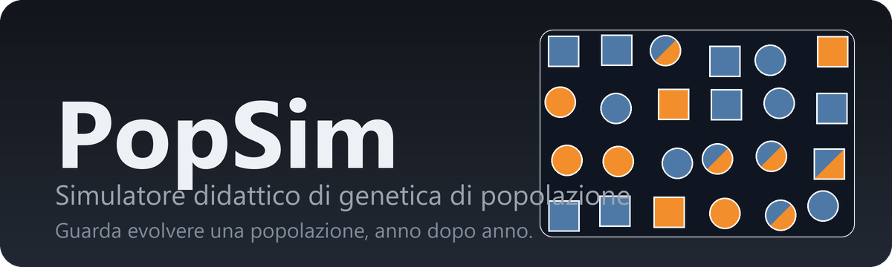

<p align="center">
  
</p>

<p align="center">
  <b>▶ Prova subito:</b> <a href="https://federicogiorgi.github.io/popsim/">federicogiorgi.github.io/popsim</a><br>
  <sub>Gira interamente nel browser · nessuna installazione · funziona anche offline</sub>
</p>

---

## Cos'è

**PopSim** è un simulatore **didattico** di genetica di popolazione. Serve a
*vedere*, in tempo reale e in modo interattivo, i concetti che di solito si
spiegano a lezione solo con le formule: l'**equilibrio di Hardy-Weinberg**, la
**deriva genetica**, la **selezione**, la **migrazione**, la **mutazione**,
l'**accoppiamento non casuale** e la **consanguineità**.

L'idea è semplice: una piccola popolazione di individui vive in un "mondo" (la
*sandbox*). Ogni individuo **nasce, si accoppia e muore**, anno dopo anno. Tu
regoli le "forze evolutive" con delle manopole e osservi come cambiano — o non
cambiano — le frequenze degli alleli nel tempo.

Pensato per l'uso in aula: pochi parametri, effetti visibili in pochi secondi,
risultati **riproducibili** (stesso seme casuale → stessa evoluzione).

## Come funziona

La simulazione si basa su **un solo gene**, che può avere fino a **9 alleli**
(A1, A2, …). Ogni individuo ha due alleli (il suo *genotipo*).

- **Forma = sesso.** Cerchio ● = femmina, quadrato ■ = maschio.
- **Colore = alleli.** Un omozigote (es. A1A1) ha una tinta unita; un
  **eterozigote** (es. A1A2) è **tagliato in diagonale**: l'allele minore in
  ordine alfabetico in alto a sinistra, il maggiore in basso a destra.
- **Tempo in anni.** Ogni passo è un anno. Gli individui hanno un'età in anni e
  una durata di vita attorno alla **vita media** impostata. Si riproducono negli
  anni di vita da 2 a n−1.
- **Posizioni non casuali.** Ogni anno un individuo è **isolato** oppure
  **accanto** al partner con cui si accoppia; la prole nasce vicino ai genitori.

Sotto il cofano il modello è a **due livelli**, e questo è il cuore didattico:

1. Le **frequenze alleliche** della popolazione sono lo stato genetico
   "autoritativo" ed evolvono per effetto delle forze. **Con tutte le forze a 0
   restano costanti**: è l'equilibrio di Hardy-Weinberg, il caso di riferimento.
2. Gli **individui** che vedi nella sandbox sono una realizzazione coerente con
   quelle frequenze, con una vera **genealogia** usata per calcolare la
   consanguineità.

### Le forze evolutive

| Manopola | Effetto |
|---|---|
| **Mortalità** | Morti per ogni nato: **1** = popolazione costante, **< 1** cresce, **> 1** diminuisce (fino all'estinzione). |
| **Deriva genetica** | Fluttuazione casuale delle frequenze (campionamento di Wright-Fisher): a 0 le frequenze restano costanti, sopra 0 compiono una passeggiata aleatoria e possono **fissarsi**. Più forte nelle popolazioni piccole (∝ 1/N). |
| **Mutazione** | Comparsa di **nuovi alleli** nel tempo (fino a un massimo di 9). |
| **Migrazione** | Ingresso/uscita di **migranti non imparentati** da/verso una popolazione esterna: avvicina le frequenze e **abbassa la consanguineità**. Il flusso è bilanciato, quindi la popolazione resta costante. |
| **Selezione** | Vantaggio direzionale a favore dell'allele **A1**. |
| **Accoppiamento non casuale** | Accoppiamento tra simili: **eccesso di omozigoti**, senza cambiare le frequenze alleliche. |

### Equilibrio di Hardy-Weinberg

Il pannello dedicato è pensato per insegnare che l'equilibrio di HW richiede
**due condizioni distinte**:

1. **Le frequenze alleliche non cambiano nel tempo** — nessuna forza attiva
   (deriva, migrazione, selezione, mutazione). Nel grafico si vede come **linee
   piatte**. Se la linea è inclinata, la popolazione sta evolvendo.
2. **Le proporzioni genotipiche sono quelle di HW** — cioè
   <code>p² + 2pq + q²  = 1</code> (accoppiamento casuale). È verificato con un
   **test chi-quadro** sui genotipi osservati contro quelli attesi. L'unica forza
   che rompe questa condizione è l'accoppiamento non casuale (produce un eccesso
   di omozigoti).

Il verdetto dice "**in equilibrio**" solo quando **entrambe** le condizioni sono
soddisfatte. È un punto su cui gli studenti spesso si confondono: la migrazione
sposta le frequenze (viola la 1) ma mantiene i genotipi in proporzioni di HW (non
viola la 2); l'accoppiamento non casuale fa il contrario.

### Consanguineità (coefficiente F)

Il coefficiente **F** è calcolato dal **pedigree**, tramite alleli **IBD**
(*Identical By Descent*) — non dal semplice essere omozigoti. Deriva dalla formula
sui cammini di Wright

```
F = Σ (1/2)ⁿ · (1 + F_A)
```

ed è **sempre compreso tra 0 e 1**: vale 0 per individui non imparentati e sale
nel tempo nelle popolazioni piccole e chiuse (0.25 già per figli di fratelli). Il
pannello mostra la consanguineità **media** della popolazione; cliccando un
individuo ne vedi l'F personale, i genitori e i figli.

## Come si usa

1. **Schermata iniziale.** Imposta numero di individui, durata (in anni), vita
   media, numero di **alleli iniziali** e le loro **frequenze**, il seme casuale,
   e regola le forze. Premi **«Avvia simulazione»**.
2. **Calcolo.** Tutti gli anni vengono simulati in blocco (barra di avanzamento).
3. **Esplorazione.** Compaiono la sandbox e i grafici. La **barra del tempo**
   (stile lettore video: play/pausa, anche con la barra spaziatrice) permette di
   scorrere qualsiasi anno; durante il "play" l'animazione è fluida. In alto a
   destra puoi modificare i parametri e premere **«Riavvia»**.
4. **Grafici.** *Frequenze alleliche nel tempo* (una linea per allele) e *Numero
   di individui nel tempo*.
5. **Dettaglio.** **Clicca un individuo** per vederne sesso, età, genotipo,
   consanguineità, genitori e figli.

## Esempi per la classe

Parti dai default e cambia **solo** i parametri indicati.

| # | Concetto | Imposta | Cosa osservi |
|---|---|---|---|
| 1 | **Equilibrio di HW** | tutto di default, N = 300 | linee piatte, "in equilibrio", genotipi osservati ≈ attesi |
| 2 | **Deriva ∝ 1/N** | Deriva = 1; confronta **N = 20** e **N = 500** | con N piccolo le frequenze oscillano e un allele si **fissa**; con N grande restano quasi piatte |
| 3 | **Selezione** | Selezione = 1, N = 200, Freq. A1 = 0.1 / A2 = 0.9 | A1, pur partendo raro, sale a curva a S fino a **fissarsi** |
| 4 | **Accoppiamento non casuale** | Accoppiamento = 1, N = 300, Freq. 0.5 / 0.5 | frequenze **ferme**, ma Hₒ → 0 e χ² enorme: "proporzioni genotipiche alterate" |
| 5 | **Isolamento e consanguineità** *(combinazione)* | N = 20, Deriva = 1 → poi aggiungi **Migrazione = 0.4** | senza migrazione: fissazione **e** F che sale; con migrazione: niente fissazione e F basso (il flusso genico "salva" la popolazione) |
| 6 | **Selezione vs deriva** *(combinazione)* | N = 15, Selezione = 0.3, Deriva = 1, Freq. A1 = 0.3 | l'allele favorito a volte si fissa, a volte si **perde** per deriva (cambia il **Seme** e rilancia): in piccole popolazioni la deriva può battere la selezione |

**Consigli:** tieni la velocità bassa (1–5×) per vedere gli individui muoversi;
il verdetto HW si legge bene guardando **la pendenza** della linea delle
frequenze; usa lo stesso **Seme** per confronti "a parità di caso".

## Note tecniche

- **JavaScript vanilla**, **moduli ES nativi**, **nessun bundler** e nessuno step
  di build: il sorgente è ciò che viene servito.
- Rendering su **Canvas 2D**, senza librerie esterne (funziona **offline**).
- Solo **percorsi relativi** (il sito vive in `/popsim/`); `.nojekyll` nella radice.
- Numeri casuali **deterministici** con seme → simulazioni riproducibili.

### Struttura del codice

```
index.html            struttura della pagina e layout
css/styles.css        stile responsive, tema chiaro/scuro
js/
  config.js           costanti, default, tavolozza colori, definizione delle manopole
  main.js             orchestratore: collega modello, renderer e interfaccia
  recorder.js         cronologia della simulazione (per tornare indietro nel tempo)
  model/              LA "GENETICA" — logica pura, indipendente dal renderer
    rng.js            generatore casuale deterministico
    genetics.js       forze sulle frequenze + misure (Hardy-Weinberg, chi-quadro)
    kinship.js        consanguineità F dal pedigree (alleli IBD)
    individual.js     fabbrica di individui (dati puri, serializzabili)
    population.js     due livelli: frequenze + individui; ciclo vitale, accoppiamento spaziale
  render/
    sandbox.js        renderer Canvas 2D degli individui (colore diagonale, animazione fluida)
  ui/
    controls.js       manopole + parametri di setup + frequenze iniziali
    timeline.js       barra temporale in stile lettore video
    chart.js          grafico delle frequenze alleliche nel tempo
    popChart.js       grafico del numero di individui nel tempo
    hwPanel.js        pannello di equilibrio di Hardy-Weinberg
    infoPanel.js      scheda dell'individuo selezionato
```

La logica di simulazione (`js/model/`) è **separata dal renderer** (`js/render/`):
il modello non conosce il canvas, quindi il renderer resta sostituibile senza
toccare la genetica.

### Prestazioni

Pensato per una **piccola popolazione** (default 50, cap 1000). Il calcolo della
consanguineità ha costo ~N² per anno, perciò popolazioni molto grandi e durate
lunghe rallentano; con mortalità < 1 la crescita è limitata da un **tetto di
sicurezza** che evita di bloccare il browser. La simulazione è **calcolata in
blocco** all'avvio e poi **registrata**: scorrere avanti e indietro resta fluido.

## Sviluppo locale

I moduli ES richiedono `http://` (non `file://`): serve il sito con un qualsiasi
server statico.

```bash
python -m http.server 8000
# poi apri http://localhost:8000/
```

## Autore

Sviluppato da **Federico M. Giorgi**.
