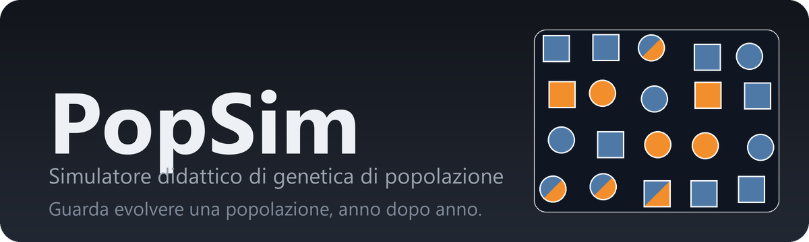

<p align="center">
  
</p>

<p align="center">
  <b>▶ Prova subito:</b> <a href="https://federicogiorgi.github.io/popsim/">federicogiorgi.github.io/popsim</a><br>
  <sub>Gira interamente nel browser · nessuna installazione · funziona anche offline</sub><br>
  <sub>🇬🇧 <a href="README.en.md">English version</a></sub>
</p>

---

## Cos'è

**PopSim** è un simulatore **didattico** di genetica di popolazione. Serve a
*vedere*, in tempo reale e in modo interattivo, i concetti che di solito si
spiegano a lezione solo con le formule: l'**equilibrio di Hardy-Weinberg**, la
**deriva genetica**, la **selezione**, la **migrazione**, la **mutazione**,
l'**accoppiamento non casuale** e la **consanguineità**.

L'idea è semplice: una piccola popolazione di individui vive in un "mondo" (la
*sandbox*). Ogni individuo **nasce, si accoppia e muore**, anno dopo anno. Tu
regoli le "forze evolutive" con delle manopole e osservi come cambiano — o non
cambiano — le frequenze degli alleli nel tempo.

Pensato per l'uso in aula: pochi parametri, effetti visibili in pochi secondi,
risultati **riproducibili** (stesso seme casuale → stessa evoluzione).

## Come funziona

La simulazione si basa su **un solo gene**, che può avere fino a **9 alleli**
(A1, A2, …). Ogni individuo ha due alleli (il suo *genotipo*).

- **Forma = sesso.** Cerchio ● = femmina, quadrato ■ = maschio.
- **Colore = alleli.** Un omozigote (es. A1A1) ha una tinta unita; un
  **eterozigote** (es. A1A2) è **tagliato in diagonale**: l'allele minore in
  ordine alfabetico in alto a sinistra, il maggiore in basso a destra.
- **Tempo in anni.** Ogni passo è un anno. Gli individui hanno un'età in anni e
  una durata di vita attorno alla **vita media** impostata. Si riproducono negli
  anni di vita da 2 a n−1.
- **Posizioni non casuali.** Ogni anno un individuo è **isolato** oppure
  **accanto** al partner con cui si accoppia; la prole nasce vicino ai genitori.

Sotto il cofano il modello è a **due livelli**, e questo è il cuore didattico:

1. Le **frequenze alleliche** della popolazione sono lo stato genetico
   "autoritativo" ed evolvono per effetto delle forze. **Con tutte le forze a 0
   restano costanti**: è l'equilibrio di Hardy-Weinberg, il caso di riferimento.
2. Gli **individui** che vedi nella sandbox sono una realizzazione coerente con
   quelle frequenze, con una vera **genealogia** usata per calcolare la
   consanguineità.

### Le forze evolutive

| Manopola | Effetto |
|---|---|
| **Mortalità** | Morti per ogni nato: **1** = popolazione costante, **< 1** cresce, **> 1** diminuisce (fino all'estinzione). |
| **Deriva genetica** | Fluttuazione casuale delle frequenze (campionamento di Wright-Fisher): a 0 le frequenze restano costanti, sopra 0 compiono una passeggiata aleatoria e possono **fissarsi**. Più forte nelle popolazioni piccole (∝ 1/N). |
| **Mutazione** | Comparsa di **nuovi alleli** nel tempo (fino a un massimo di 9). |
| **Migrazione (Flusso genico)** | Ingresso/uscita di **migranti non imparentati** da/verso una popolazione esterna: avvicina le frequenze e **abbassa la consanguineità**. Il flusso è bilanciato, quindi la popolazione resta costante. |
| **Selezione** | Vantaggio direzionale a favore dell'allele **A1**. |
| **Accoppiamento non casuale** | Accoppiamento tra simili: **eccesso di omozigoti**, senza cambiare le frequenze alleliche. Gli eterozigoti calano **gradualmente** fino a (1 − valore) del livello iniziale, tanto più in fretta quanto più il valore è alto: a 0.5 si dimezzano in circa 50 generazioni (500 anni con vita media 10), a 0.9 scendono al 10% in ~10 generazioni, a 1 spariscono in una. |

### Equilibrio di Hardy-Weinberg

Hardy-Weinberg è una **previsione**: se nessuna forza agisce, dalle frequenze
alleliche p e q di una generazione nascono genotipi nelle proporzioni
<code>p² + 2pq + q² = 1</code>, e le frequenze restano le stesse generazione dopo
generazione. Il pannello verifica **due condizioni**, mostrate come due verifiche
separate (① e ②), e sopra un verdetto che dice "**in equilibrio**" solo quando
**entrambe** sono soddisfatte:

1. **Le frequenze alleliche sono stabili nel tempo** (negli ultimi 30 anni). Nel
   grafico si vede come **linee piatte**; se la linea è inclinata, la popolazione
   sta evolvendo.
2. **I genotipi sono quelli previsti da Hardy-Weinberg** — **test chi-quadro**
   tra i genotipi **osservati oggi** e quelli **attesi** (p², 2pq, q²) calcolati
   dalle frequenze alleliche di **30 anni fa** (alcune generazioni prima). Le
   frequenze attese sono fissate in anticipo, quindi i gradi di libertà sono
   (classi genotipiche − 1).

Con questo confronto **ogni forza produce uno scostamento da HW**: deriva,
selezione, migrazione e mutazione spostano le frequenze alleliche (i genotipi di
oggi non sono più quelli previsti), l'accoppiamento non casuale altera le
proporzioni (eccesso di omozigoti). Un allele nuovo comparso per mutazione rende
i genotipi addirittura impossibili rispetto alla previsione. Senza forze,
osservati e attesi coincidono. Anche il grafico *Frequenze genotipiche nel
tempo* usa gli stessi attesi.

Due note per l'aula:

- Il test è statistico: con **pochi individui** o una **deriva debole** lo
  spostamento può non essere ancora significativo (la deriva è essa stessa
  fluttuazione casuale), mentre la verifica ① lo vede comunque.
- Se il χ² è significativo ma **nessuna forza è attiva**, la ② lo segnala come
  probabile fluttuazione campionaria (falso positivo atteso nel ~5% dei casi) e
  il verdetto non cambia.

### Consanguineità (coefficiente F)

Il coefficiente **F** è calcolato dal **pedigree**, tramite alleli **IBD**
(*Identical By Descent*) — non dal semplice essere omozigoti. Deriva dalla formula
sui cammini di Wright

```
F = Σ (1/2)ⁿ · (1 + F_A)
```

ed è **sempre compreso tra 0 e 1**: vale 0 per individui non imparentati e sale
nel tempo nelle popolazioni piccole e chiuse (0.25 già per figli di fratelli). Il
pannello mostra la consanguineità **media** della popolazione; cliccando un
individuo ne vedi l'F personale, i genitori e i figli.

## Come si usa

1. **Schermata iniziale.** Imposta numero di individui, durata (in anni), vita
   media, numero di **alleli iniziali** e le loro **frequenze**, il seme casuale,
   e regola le forze. Premi **«Avvia simulazione»**.
2. **Calcolo.** Tutti gli anni vengono simulati in blocco (barra di avanzamento).
3. **Esplorazione.** Su schermo largo la simulazione sta in **una sola
   schermata 16:9**, pensata per il proiettore (il testo cresce con lo
   schermo): a sinistra la sandbox, la **barra del tempo** e il grafico delle
   frequenze alleliche; a destra l'esito di **Hardy-Weinberg** (✓ Sì / ✗ No),
   le forze e i parametri, con **«Riavvia»** in fondo. La barra del tempo (stile
   lettore video: play/pausa, anche con la barra spaziatrice) permette di
   scorrere qualsiasi anno; durante il "play" l'animazione è fluida. Scorrendo
   la pagina trovi gli altri grafici e il dettaglio di Hardy-Weinberg.
4. **Grafici.** *Frequenze alleliche nel tempo* (una linea per allele),
   *Frequenze genotipiche nel tempo* e *Numero di individui nel tempo*. Nel
   grafico dei genotipi ogni genotipo ha due linee: **spessa** = frequenza
   osservata, **sottile** = frequenza attesa sotto Hardy-Weinberg (p², 2pq, q²).
   Se le due linee si separano, le proporzioni genotipiche non sono quelle di HW.
   Gli omozigoti hanno il colore del proprio allele, gli eterozigoti una linea a
   due colori alternati (come i simboli tagliati in diagonale nella sandbox).
5. **Dettaglio.** **Clicca un individuo** per vederne sesso, età, genotipo,
   consanguineità, genitori e figli.

## Esempi per la classe

Gli esempi usati a lezione. Parti dai **valori di default** e cambia **solo** i
parametri indicati.

| # | Concetto | Parametri | Cosa si osserva |
|---|---|---|---|
| 1 | **Equilibrio di Hardy-Weinberg** — il caso di riferimento, il "modello nullo" | tutti di default | le due linee delle frequenze restano **piatte** (A1 = 0.6, A2 = 0.4); il pannello dice "in equilibrio"; genotipi osservati ≈ attesi (p², 2pq, q²). Senza forze le frequenze non cambiano: nessuna evoluzione in atto |
| 2 | **Selezione forte** (un allele resta l'unico) | Selezione = 0.5, N. individui = 200, Freq. A1 = 0.1, Freq. A2 = 0.9 | A1, pur partendo raro, soppianta l'altro. Durante la salita: "NON in equilibrio" (le frequenze cambiano); a fissazione avvenuta torna in equilibrio di Hardy-Weinberg |
| 3 | **Deriva genetica**: popolazione piccola vs grande | Run A: Deriva = 0.3, N. individui = 20 · Run B: Deriva = 0.3, N. individui = 500 | nella Run A le frequenze oscillano molto e spesso un allele scompare in poche centinaia d'anni; nella Run B le linee restano quasi piatte. La deriva è tanto più forte quanto più piccola è la popolazione |
| 4 | **Accoppiamento non casuale** | Accoppiamento non casuale = 0.5, N. individui = 300 | le frequenze alleliche restano **ferme** ai valori iniziali (linee piatte!), ma nel grafico dei genotipi la linea degli eterozigoti scende piano piano e in circa 500 anni si assesta a **metà** del livello iniziale (da 48% a ~24%); Hardy-Weinberg: "NO" (verifica ②). È l'unica forza che cambia le proporzioni genotipiche senza cambiare le frequenze alleliche. Con valore 1 gli eterozigoti spariscono in una generazione |
| 5 | **Popolazione isolata**: deriva + immigrazione *(combinazione)* | Run A: N. individui = 20, Deriva = 1 · Run B (*rescue*): come A + Migrazione (flusso genico) = 0.4 | Run A: la piccola popolazione perde un allele. Run B: la variabilità genetica della piccola popolazione viene salvata da una costante immigrazione |
| 6 | **Selezione debole contro la deriva** *(combinazione)* | Durata = 100 anni, Selezione = 0.3, Deriva = 1, Freq. A1 = 0.1, Freq. A2 = 0.9 | l'allele favorito A1 a volte si fissa, a volte viene perso per deriva: cambiando il seme cambia l'esito. **Seme = 1**: A1 si perde per deriva; **Seme = 2**: A1 si fissa e resta l'unico; **Seme = 5**: da osservare. In popolazioni piccole la deriva può sopraffare una selezione debole |
| 7 | **Mutazione** (nascita di nuovi alleli) | Mutazione = 1, Deriva genetica = 0.1, Durata = 10000 anni | nel tempo compaiono nuove linee colorate (A3, A4, … fino a 9); alcuni alleli restano nella popolazione, altri scompaiono subito (provare con vari semi). La mutazione è la sorgente ultima della variabilità |
| Bonus | **Scostamento da Hardy-Weinberg** | N. individui = 150, Deriva = 1 | controlla se la popolazione è in equilibrio di Hardy-Weinberg (per lunghi periodi entrambe le verifiche ① e ② risultano "no"), poi riprova con le altre forze |

**Consigli:** tieni la velocità bassa (1–5×) per vedere gli individui muoversi;
usa lo stesso **Seme** per confronti "a parità di caso".

## Note tecniche

- **JavaScript vanilla**, **moduli ES nativi**, **nessun bundler** e nessuno step
  di build: il sorgente è ciò che viene servito.
- Rendering su **Canvas 2D**, senza librerie esterne (funziona **offline**).
- Interfaccia in **italiano** (default) e **inglese**: si cambia con le bandierine in alto a
  destra, accanto all'interruttore del tema chiaro/scuro.
- Solo **percorsi relativi** (il sito vive in `/popsim/`); `.nojekyll` nella radice.
- **Versione dei file** (`?v=N` in `index.html`, anche nell'import map dei moduli):
  va aumentata a ogni rilascio, così i browser non mescolano file vecchi in cache
  con file nuovi. Ogni nuovo modulo in `js/` va aggiunto all'import map.
- Numeri casuali **deterministici** con seme → simulazioni riproducibili.

### Struttura del codice

```
index.html            struttura della pagina e layout
css/styles.css        stile responsive, tema chiaro/scuro (di default quello del sistema)
js/
  config.js           costanti, default, tavolozza colori, definizione delle manopole
  i18n.js             testi dell'interfaccia in italiano e inglese (scelta ricordata nel browser)
  main.js             orchestratore: collega modello, renderer e interfaccia
  recorder.js         cronologia della simulazione (per tornare indietro nel tempo)
  model/              LA "GENETICA" — logica pura, indipendente dal renderer
    rng.js            generatore casuale deterministico
    genetics.js       forze sulle frequenze + misure (Hardy-Weinberg, chi-quadro)
    kinship.js        consanguineità F dal pedigree (alleli IBD)
    individual.js     fabbrica di individui (dati puri, serializzabili)
    population.js     due livelli: frequenze + individui; ciclo vitale, accoppiamento spaziale
  render/
    sandbox.js        renderer Canvas 2D degli individui (colore diagonale, animazione fluida)
  ui/
    controls.js       manopole + parametri di setup + frequenze iniziali
    timeline.js       barra temporale in stile lettore video
    chart.js          grafico delle frequenze alleliche nel tempo
    genoChart.js      grafico delle frequenze genotipiche (osservate e attese HW) nel tempo
    popChart.js       grafico del numero di individui nel tempo
    theme.js          interruttore del tema chiaro/scuro (scelta ricordata nel browser)
    hwPanel.js        pannello di equilibrio di Hardy-Weinberg
    infoPanel.js      scheda dell'individuo selezionato
```

La logica di simulazione (`js/model/`) è **separata dal renderer** (`js/render/`):
il modello non conosce il canvas, quindi il renderer resta sostituibile senza
toccare la genetica.

### Prestazioni

Pensato per una **piccola popolazione** (default 50, cap 1000). Il calcolo della
consanguineità ha costo ~N² per anno, perciò popolazioni molto grandi e durate
lunghe rallentano; con mortalità < 1 la crescita è limitata da un **tetto di
sicurezza** che evita di bloccare il browser. La simulazione è **calcolata in
blocco** all'avvio e poi **registrata**: scorrere avanti e indietro resta fluido.

## Sviluppo locale

I moduli ES richiedono `http://` (non `file://`): serve il sito con un qualsiasi
server statico.

```bash
python -m http.server 8000
# poi apri http://localhost:8000/
```

## Licenza

Rilasciato con [licenza MIT](LICENSE).

## Autore

Sviluppato da **Federico M. Giorgi**.
